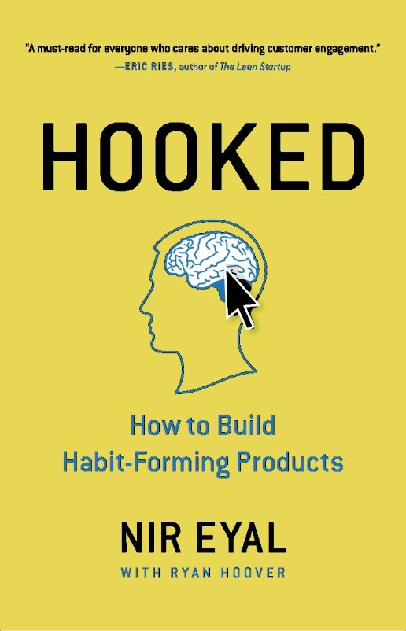
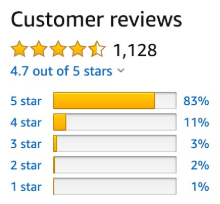
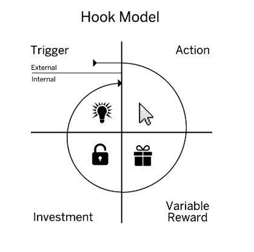
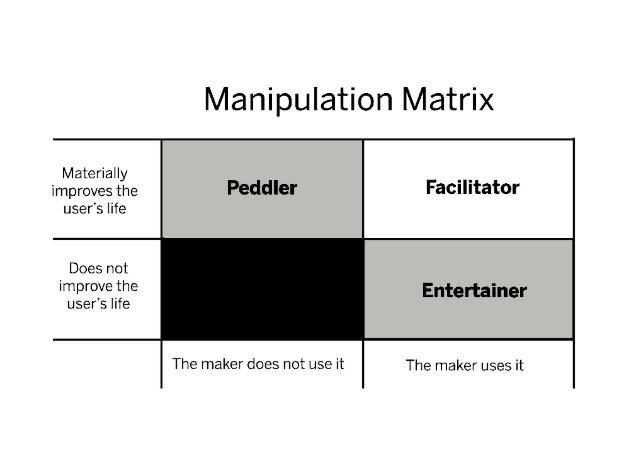
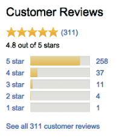

**SUPPLEMENTAL W**Copyrig**O**ht © 201**R**4 Nir Ey**K**al, NirAn**B**dFar.com**O**. All righ**O**ts reserv**K**ed.

HOOKED WORKBOOK | CHAPTER X 1

[Amazon.com](http://nirandfar.com/gethooked)[ Barnes & Nobles](http://www.barnesandnoble.com/w/hooked-nir-eyal/1119342753)[ IndieBound.org](http://www.indiebound.org/book/9781591847786)![ref1]![ref2]![ref3]![ref4]

**TESTIMONIALS**

![ref5]

**Stephen P. Anderson![ref6]**

Author of “Seductive Interaction Design”

*“You’ll read this. Then you’ll hope your competition isn’t reading this.* 

*It’s that good.”*

![ref7]

**Andrew Chen**\
Technology Writer & Investor

*“When it comes to driving engagement and building habits, Hooked is an       excellent guide into the mind of the user.”*

![ref8]

**Dave McClure**\
Founder of 500 startups

*“Nir’s work is an essential crib sheet for any startup looking to understand user psychology.”*

*“This* *is* *the* *absolute* *best* *book* *on* *product* *development* *I've* *ever* *read.”* 

J. Walnes | 220 reviewers made a similar statement

` `*“If* *you* *read* *one* *“product* *book”* *this* *year,* *make* *sure* *it’s* *this* *one.”* 

Daniel J Groch  | 68 reviewers made a similar statement

*“A must-read! Super inspiring and down-to-earth.”* Zornitsa  Tomova   |  36  reviewers made a similar statement

**INTRODUCTION**

**Note from the Author:**

One of the key lessons I stress in my book, *Hooked: How to Build Habit-Forming Products*, is the importance of simplicity. When a behavior is easier to do, it is more likely people will do it. 

Hence, if I wanted people to act upon what they read in my book, I needed to find a way to 

simplify the action I wanted them to take. This supplemental workbook is designed to guide you through thinking and applying the lesson in *Hooked* to your own business. It is not a replacement for the book of course, but rather a place to reinforce the main ideas and digest what you’ve learned. 

Though not exhaustive, lessons from select chapters are bullet-pointed and come with accompanying exercises to guide you through the steps of designing a habit-forming product or service of your own. By the end this workbook, you should have a deeper understanding of the Hooked Model and a set of hypotheses you can test to make your product or service more engaging.

I wish you great success and hope you will use what you learn to build things that move people! Sincerely,

[Nir Eyal ](http://NirAndFar.com)

NirAndFar.com

HOOKED SUPPLEMENTAL WORKBOOK 2

**THE BASICS OF HABITS**

**Remember this:**

- *Habits* are defined as “behaviors done with little or no conscious thought”
- The Hooked Mod el has four phases: ***trigg*** ***er,*** ***action,*** ***v ariable*** ***reward***, and ***investment***.

`   `*(Figure 1)*

- Hooks are experiences designed to connect the user’s problem to a solution frequently    enough to form a habit
- To form a habit, people must do the behavior frequently.

*Note: Make sure you read the introduction and first chapter of Hooked to fully understand these concepts before completing the exercises next.* 

*Figure* *1:* *The* *Hooked* *Model*

HOOKED SUPPLEMENTAL WORKBOOK 4

**EXERCISE 1:**

1) Select the product or service you want to make more engaging. We will use this project for all the subsequent exercises. Write down the name of the project here:![ref9]
1) Why does your business model require users form a habit? ![ref10]
1) What problem are users solving with your product?![ref11]
1) How do users currently solve that problem and why does it need a solution? ![ref11]
1) What is the user behavior you want to turn into a habit? (the intended habitual behavior)![ref10]![ref9]

HOOKED SUPPLEMENTAL WORKBOOK  5

6) How frequently do you expect users to engage with your product? 

*(Note: If the behavior does not occur within a week’s time or less, you may have a very difficult time forming a habit.)*

HOOKED SUPPLEMENTAL WORKBOOK 6

**TRIGGERS![ref12]**

**Remember this:**

- ***Triggers*** cue the user to take action and are the first step in the Hooked Model.
- Triggers come in two types—external and internal.
- *External triggers* tell the user what to do next by placing information within the 

`     `user’s environment.

- *Internal triggers* tell the user what to do next through associations stored in the 

`     `user’s memory.

- Negative emotions frequently serve as internal triggers.
- Be sure to understand which user emotions may be tied to internal triggers and know    how to leverage external triggers to drive the user to action.

*Note: Make sure you read the second chapter of Hooked to fully understand these concepts before completing the exercises next. *

HOOKED SUPPLEMENTAL WORKBOOK  7

**EXERCISE 2:**

1) Who is your product’s user? Be clear about the person you intend to help form a habit. Can you name a real person you know that needs your product?![ref13]![ref14]
1) What is the user doing right before he or she does the intended habitual behavior you defined in Exercise 1?![ref13]![ref15]
1) Using the 5 Whys technique described in the book, come up with three internal triggers that  could cue your user to action. 
1) What internal trigger does your user experience most often?![ref16]

HOOKED SUPPLEMENTAL WORKBOOK  8

5) Using your most frequent internal trigger and the intended habitual behavior you described   in Exercise 1, finish the brief narrative below

   Every time the user    (internal trigger)    , he/she   (intended habitual behavior).![ref13]

   *For example: Every time the Jenny feels bored, she opens the Facebook app on her phone.*

6) Referring back to question 2, what might be the best places and times to display an   external trigger?![ref16]
6) How can you time your external trigger so that it fires as closely as possible to when your  user experiences their internal trigger?![ref14]![ref17]
6) Think of at least three conventional ways (e-mails, direct mail, text messages, etc.)  

   ` `and three crazy or currently impossible ways (wearable computers, biometric sensors, 

   ` `carrier pigeons, etc.) to trigger your user with an external trigger the moment he or she     experiences the internal trigger.![ref14]![ref15]![ref17]

HOOKED SUPPLEMENTAL WORKBOOK  9
**EXERCISE 3:**

**ACTION![ref12]**

**Remember this:**

- The second step in the Hooked Model is the ***Action***.
- The action is the simplest behavior in anticipation of reward.
- Dr. B. J. Fogg’s Behavior Model says:
- For any behavior to occur, a trigger must be present at the same time as the user has           

`    `sufficient ability and motivation to take action.

- To increase the desired behavior, ensure a clear trigger is present; next, increase ability   

`     `by making the action easier to do; finally, align with the right motivator.

- Every behavior is driven by one of three Core Motivators: 4Seeking pleasure and avoiding pain

  4Seeking hope and avoiding fear

  4Seeking social acceptance while avoiding social rejection.

- *Ability* is user and context dependent and is influenced by six factors: time,

`      `money, physical effort, brain cycles, social deviance, and non-routineness.

- *Heuristics* are cognitive shortcuts we take to make quick decisions. Product designers 

`   `can utilize many of the hundreds of heuristics to increase the likelihood of their intended         habitual behavior.

*Note: Make sure you read the third chapter of Hooked to fully understand these concepts before completing the exercises next. *

1) Starting from the time your user feels their internal trigger, count the number of steps it      takes to reach the expected outcome. 
1. How does this process compare with the simplicity of some of the examples  described in chapter 3 of Hooked? ![ref18]
1. How does this compare with competitors’ products and services?![ref18]
2) What is limiting your users’ ability to accomplish the intended habitual behavior?**     *(Circle all that apply)*

HOOKED SUPPLEMENTAL WORKBOOK  11
**EXERCISE 3:**

Time

Brain cycles (too confusing) Money

Social deviance (outside the norm) Physical effort 

Non-routine (too new)

HOOKED SUPPLEMENTAL WORKBOOK  11
**EXERCISE 3:**

3) Brainstorm three testable ways you can make the intended habitual behavior easier to complete by removing the barriers you circled above. Consider how you might apply heuristics to make the intended behavior more likely.

HOOKED SUPPLEMENTAL WORKBOOK  11

**VARIABLE REWARD![ref19]**

**Remember this:**

- ***Variable*** ***reward*** is the third phase of the Hooked Model
- *Rewards* *of* *the* *tribe:* the search for social rewards fueled by connectedness with other people.
- *Rewards of the hunt:* the search for material resources and information.
- *Rewards of the self:* the search for intrinsic rewards of mastery, competence,  

`      `and completion.

*Note: Make sure you read the fourth chapter of Hooked to fully understand these concepts before completing the exercises next. *

HOOKED SUPPLEMENTAL WORKBOOK  12
**EXERCISE 4:**

1) Speak with five of your customers or users in an open-ended interview; identify what they find enjoyable or encouraging about using your product. Make note of any moments of delight or surprise. Is there anything they find particularly satisfying about using the product? ![ref20]![ref21]
1) Review the steps your customer takes to use your product or service habitually in Exercise 3. What outcome (reward) alleviates the user’s pain? Is the reward fulfilling? 

   Does it leave the user wanting more?![ref22]![ref23]![ref24]

3) Brainstorm three ways your product might heighten users’ search for variable rewards using the variable reward types below:
1. Rewards of the tribe![ref25]![ref22]![ref26]
1. Rewards of the hunt![ref21]![ref27]
1. Rewards of the self![ref23]![ref28]

HOOKED SUPPLEMENTAL WORKBOOK  13

**INVESTMENT![ref19]**

**Remember this:**

- The ***investment*** ***phase*** is the fourth step in the Hooked Model.
- Unlike the action phase, which delivers *immediate gratification*, the investment phase     concerns the expectation of a *future* benefit.
- Investments in a product influence customer preferences because people tend to:  

`  `overvalue their work, seek to be consistent with past behaviors, and avoid cognitive dissonance.

- Investments increase the likelihood of users returning by improving the service the more it is    used. Investments “store value” in the form of content, data, followers, reputation, and skill. 
- Investments increase the likelihood of users passing through the Hook again by loading the    next trigger to start the cycle all over again.

*Note: Make sure you read the fifth chapter of Hooked to fully ![ref29]understand these concepts before completing the exercises next. *

HOOKED SUPPLEMENTAL WORKBOOK 14
**EXERCISE 5:**

1) Review your flow. What “bit of work” are your users doing to increase their likelihood  of returning?![ref22]![ref23]![ref24]
1) Brainstorm three ways to add small investments into your product to:
1. Load the next trigger.![ref25]![ref22]![ref26]
1. Store value as data, content, followers, reputation, and skill.![ref30]![ref31]
3) Identify how long it takes for a “loaded trigger” to reengage your users. 

   ` `How can you reduce the delay to shorten time spent cycling through the Hook? ![ref27]![ref21]![ref28]

4) Now that you have several testable ways to improve your product or service from doing  these exercises, write down which insight from this book you would like to implement first.![ref31]![ref30]![ref20]

HOOKED SUPPLEMENTAL WORKBOOK  15

**WHAT ARE YOU GOING TO DO WITH THIS?![ref12]**

**Remember this:**

- To help you assess the morality behind how you influence users behavior, it is helpful to determine which of the four categories your work fits into.

*Note: Make sure you read the sixth chapter of Hooked to fully understand these concepts before completing the exercises next. *

HOOKED SUPPLEMENTAL WORKBOOK  16
**EXERCISE 6:**

1) Take a minute to consider where you fall on the Manipulation Matrix. 
1. Do you use your own product or service? 
1. Do you believe that the behavior you are designing materially improves people’s  lives? Why or why not? 
2) Are you a facilitator, peddler, dealer, or entertainer? Are you comfortable with where  you are on the manipulation matrix?

HOOKED SUPPLEMENTAL WORKBOOK  17

**HABIT TESTING AND WHERE TO LOOK FOR HABIT-FORMING OOPPORTUNITIES**

**Remember this:**

- The Hooked Model helps uncover potential weaknesses in an existing product’s habit-   forming potential.
- Once a product is built, *Habit Testing* helps: uncover product devotees, discover which product elements (if any) are habit forming, and why those aspects of your product change user behavior. 
- Habit Testing includes three steps: *identify, codify,* and *modify.*
- Identifying areas where a new technology makes cycling through the Hooked Model   faster, more frequent, or more rewarding provides fertile ground for developing new

  `  `habit-forming products.

- *Nascent behaviors* are new behaviors that few people see or do yet ultimately fulfill a mass-market need.

*Note: Make sure you read the seventh chapter of Hooked to fully understand these concepts before completing the exercises next. ![ref29]*

HOOKED SUPPLEMENTAL WORKBOOK  18
**EXERCISE 7:**

If you have an existing product or service, ask yourself the following questions:

` `*(Note that answering these questions requires collecting and analyzing user data.)*

1) How frequently would you expect a habituated user to interact with your product or service? (Refer back to your answer to Question 6 in Exercise 1.)![ref32]![ref33]![ref34]
1) What percentage of users used your product habitually over the past 60 days? ![ref35]
1) What is unique about these habituated users? What did they do with your products that  non-habituated users did not?![ref32]![ref33]![ref34]
1) Can you modify the experience users have with your product so that all users take the same actions as your habituated users? ![ref35]

HOOKED SUPPLEMENTAL WORKBOOK 19

**This next exercise will help sharpen your ability to find new opportunities for habit-forming products and requires some field research.** 

1) During the next week, be aware of your behaviors and emotions as you use everyday 

   ` `products or services. Now that you know the phases of the Hooked Model, consider how  these things could be made more habit-forming.

1. Write down a product or service you observed yourself using habitually (with little  or no conscious thought) over the course of the week.![ref36]
1. What triggered you to use the product? Were you prompted externally or through  internal means? ![ref36]
1. How could it be made easier to use? ![ref37]
1. How could it be designed for more frequent use?![ref37]

HOOKED SUPPLEMENTAL WORKBOOK 20

5. How could it be made more rewarding? ![ref38]![ref39]
5. How might it solicit more user investment to make the product better with use and load the next trigger?
2) Think of a product you used this week in a way the maker had not intended. How did  you modify the product? Consider if this nascent behavior might appeal to others and  warrants a product of its own?![ref39]![ref38]![ref40]
2) Observe your target user and see what products or services they modify to meet their 

   ` `needs in unique ways (this is fertile ground for innovation!). Can your product or service  turn a few customers’ modifications into a solution with wider appeal?![ref40]

HOOKED SUPPLEMENTAL WORKBOOK  21
**SPECIAL OFFER**

Buy *Hooked* now and receive a special book bundle. You’ll receive four valuable resources to help you build habits in yourself and your user

First, buy your copy of *Hooked* by clicking a retailer below, then visit:

[www.hookmodel.com/#special-offer](http://www.hookmodel.com/#special-offer)

[Amazon.com](http://nirandfar.com/gethooked)[ Barnes & Nobles](http://www.barnesandnoble.com/w/hooked-nir-eyal/1119342753)[ IndieBound.org](http://www.indiebound.org/book/9781591847786)![ref1]![ref2]![ref3]![ref4]

**TESTIMONIALS**

**SPECIAL OFFER**

Buy *Hooked* now and receive a special book bundle. You’ll receive four valuable resources to help you build habits in yourself and your user

First, buy your copy of *Hooked* by clicking a retailer below, then visit:

[www.hookmodel.com/#special-offer](http://www.hookmodel.com/#special-offer)

![ref5]

**Stephen P. Anderson![ref6]**

Author of “Seductive Interaction Design”

*“You’ll read this. Then you’ll hope your competition isn’t reading this.* 

*It’s that good.”*

![ref7]

**Andrew Chen**\
Technology Writer & Investor

*“When it comes to driving engagement and building habits, Hooked is an       excellent guide into the mind of the user.”*

![ref8]

**Dave McClure**\
Founder of 500 startups

*“Nir’s work is an essential crib sheet for any startup looking to understand user psychology.”*

**SPECIAL OFFER**

Buy *Hooked* now and receive a special book bundle. You’ll receive four valuable resources to help you build habits in yourself and your user

First, buy your copy of *Hooked* by clicking a retailer below, then visit:

[www.hookmodel.com/#special-offer](http://www.hookmodel.com/#special-offer)

*“The book, very easy to read and understand the topic.” *Radek Vacha  | 97 reviewers made a similar statement

*“If you read one “product book” this year, make sure it’s this one.”* Mr Daniel J Groch  | 68 reviewers made a similar statement

*“Nir shares some great insight that I applied in my product design.”* Cyril Labidi  | 52 reviewers made a similar statement

[ref1]: Aspose.Words.8b1858fe-2226-41ef-9739-963849c546ca.003.png
[ref2]: Aspose.Words.8b1858fe-2226-41ef-9739-963849c546ca.004.png
[ref3]: Aspose.Words.8b1858fe-2226-41ef-9739-963849c546ca.005.png
[ref4]: Aspose.Words.8b1858fe-2226-41ef-9739-963849c546ca.006.png
[ref5]: Aspose.Words.8b1858fe-2226-41ef-9739-963849c546ca.007.png
[ref6]: Aspose.Words.8b1858fe-2226-41ef-9739-963849c546ca.008.png
[ref7]: Aspose.Words.8b1858fe-2226-41ef-9739-963849c546ca.009.png
[ref8]: Aspose.Words.8b1858fe-2226-41ef-9739-963849c546ca.010.png
[ref9]: Aspose.Words.8b1858fe-2226-41ef-9739-963849c546ca.018.png
[ref10]: Aspose.Words.8b1858fe-2226-41ef-9739-963849c546ca.021.png
[ref11]: Aspose.Words.8b1858fe-2226-41ef-9739-963849c546ca.024.png
[ref12]: Aspose.Words.8b1858fe-2226-41ef-9739-963849c546ca.031.png
[ref13]: Aspose.Words.8b1858fe-2226-41ef-9739-963849c546ca.035.png
[ref14]: Aspose.Words.8b1858fe-2226-41ef-9739-963849c546ca.036.png
[ref15]: Aspose.Words.8b1858fe-2226-41ef-9739-963849c546ca.038.png
[ref16]: Aspose.Words.8b1858fe-2226-41ef-9739-963849c546ca.042.png
[ref17]: Aspose.Words.8b1858fe-2226-41ef-9739-963849c546ca.050.png
[ref18]: Aspose.Words.8b1858fe-2226-41ef-9739-963849c546ca.053.png
[ref19]: Aspose.Words.8b1858fe-2226-41ef-9739-963849c546ca.061.png
[ref20]: Aspose.Words.8b1858fe-2226-41ef-9739-963849c546ca.064.png
[ref21]: Aspose.Words.8b1858fe-2226-41ef-9739-963849c546ca.066.png
[ref22]: Aspose.Words.8b1858fe-2226-41ef-9739-963849c546ca.067.png
[ref23]: Aspose.Words.8b1858fe-2226-41ef-9739-963849c546ca.068.png
[ref24]: Aspose.Words.8b1858fe-2226-41ef-9739-963849c546ca.069.png
[ref25]: Aspose.Words.8b1858fe-2226-41ef-9739-963849c546ca.070.png
[ref26]: Aspose.Words.8b1858fe-2226-41ef-9739-963849c546ca.071.png
[ref27]: Aspose.Words.8b1858fe-2226-41ef-9739-963849c546ca.073.png
[ref28]: Aspose.Words.8b1858fe-2226-41ef-9739-963849c546ca.074.png
[ref29]: Aspose.Words.8b1858fe-2226-41ef-9739-963849c546ca.076.png
[ref30]: Aspose.Words.8b1858fe-2226-41ef-9739-963849c546ca.078.png
[ref31]: Aspose.Words.8b1858fe-2226-41ef-9739-963849c546ca.080.png
[ref32]: Aspose.Words.8b1858fe-2226-41ef-9739-963849c546ca.095.png
[ref33]: Aspose.Words.8b1858fe-2226-41ef-9739-963849c546ca.096.png
[ref34]: Aspose.Words.8b1858fe-2226-41ef-9739-963849c546ca.097.png
[ref35]: Aspose.Words.8b1858fe-2226-41ef-9739-963849c546ca.099.png
[ref36]: Aspose.Words.8b1858fe-2226-41ef-9739-963849c546ca.103.png
[ref37]: Aspose.Words.8b1858fe-2226-41ef-9739-963849c546ca.109.png
[ref38]: Aspose.Words.8b1858fe-2226-41ef-9739-963849c546ca.113.png
[ref39]: Aspose.Words.8b1858fe-2226-41ef-9739-963849c546ca.115.png
[ref40]: Aspose.Words.8b1858fe-2226-41ef-9739-963849c546ca.119.png
